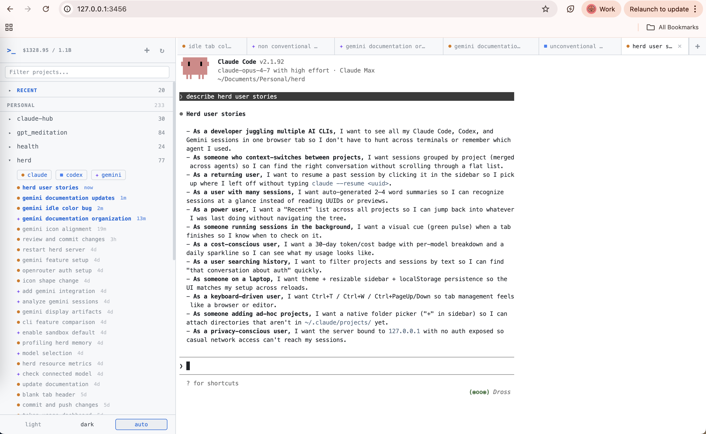

# Herd

Web-based terminal multiplexer for [Claude Code](https://docs.anthropic.com/en/docs/claude-code), [Codex](https://github.com/openai/codex), and Gemini CLI sessions.

Browse, resume, and manage AI coding sessions across all your projects from a single browser tab.



## Features

- **Project sidebar** — all projects with Claude Code, Codex, and/or Gemini CLI history, merged by directory
- **Recent sessions** — cross-project "Recent" section showing the 20 most recent sessions
- **Search/filter** — filter projects by name and sessions by summary/preview text
- **Session browser** — sessions per project with AI-generated summaries
- **Terminal tabs** — multiple concurrent Claude Code / Codex / Gemini CLI terminals with tab management
- **Resume sessions** — click any past session to resume it
- **Auto-naming** — tabs named by Haiku from terminal output, with stale summary re-generation
- **Live summary updates** — session names update in real-time via SSE as summaries are generated
- **Double-click rename** — manual tab naming
- **Token usage dashboard** — 30-day cost and token breakdown by model, with daily cost sparkline
- **Add project** — native macOS folder picker to add arbitrary project directories
- **Theme system** — dark, light, and auto (system) themes
- **Keyboard shortcuts** — Ctrl+W (close tab), Ctrl+T (new session), Ctrl+PageDown/PageUp (cycle tabs)
- **New tab button** — "+" button in tab bar for quick session creation
- **Smart scroll** — auto-scrolls output only when you're at the bottom; preserves position when scrolled up
- **Auto-reconnect** — WebSocket reconnection with exponential backoff on disconnect
- **Resizable sidebar** — drag to resize, width persisted across reloads
- **Finished tab indicator** — green pulse on background tabs that finish while you're away

## Setup

```bash
npm install
```

## Usage

```bash
npm start
# → http://localhost:3456
```

Open in browser. Click a project to see sessions. Click "+ new session" to launch Claude Code in that project's directory, or click an existing session to resume it.

Configure with environment variables:

- `PORT` — server port (default: `3456`)
- `HOST` — bind address (default: `127.0.0.1`)

## Testing

```bash
npm test
```

Tests use [Playwright](https://playwright.dev/) for browser-level integration testing.

## How it works

- Scans `~/.claude/projects/` for Claude Code session history (JSONL files)
- Scans `~/.codex/sessions/` for Codex rollout files, merges with Claude projects by working directory
- Scans `~/.gemini/tmp/` for Gemini CLI logs, merged into the same unified project view
- Decodes project paths from Claude Code's dash-separated directory naming via a backtracking solver
- Parses first user message from each session for preview text
- Uses Claude Haiku to generate 2-4 word session summaries (cached in `summaries.json` with timestamps; stale summaries auto-regenerate)
- Computes 30-day token usage and estimated costs from JSONL usage data, with per-model pricing
- Pushes summary updates to the frontend in real-time via Server-Sent Events
- Spawns real PTY via macOS `script` command (no native dependencies)
- xterm.js in the browser for terminal rendering
- WebSocket per terminal for real-time I/O

## Stack

- **Backend**: Node.js, Express, WebSocket (`ws`), SSE
- **Frontend**: Vanilla JS, xterm.js (CDN)
- **PTY**: macOS `script -q /dev/null` (no native dependencies)
- **Agents**: Claude Code via `claude` CLI, Codex via `codex` CLI, Gemini via `gemini` CLI
- **Naming**: Claude Haiku via `claude` CLI (no API key needed)
- **Tests**: Playwright

## Limitations

- **macOS only** — the `script -q /dev/null` PTY wrapper and `osascript` folder picker are macOS-specific
- **Terminal resize** — SIGWINCH is sent but underlying PTY size is fixed at initial dimensions (full resize requires node-pty)
- **No auth** — binds to localhost only; not intended for network exposure
- **Estimated costs** — token usage costs are computed from JSONL data with hardcoded pricing, not from actual billing
